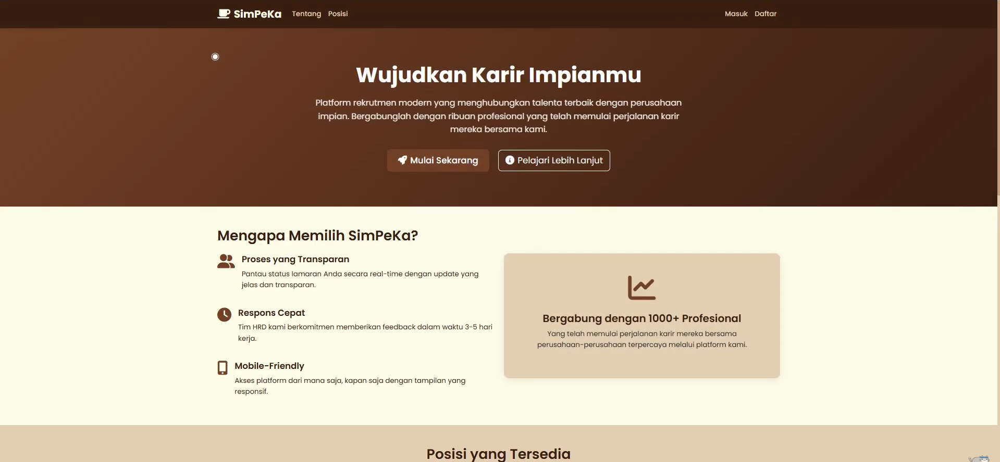

# 🌟 SimPeKa: Wujudkan Karir Impianmu

**SimPeKa** adalah platform rekrutmen modern yang saya kembangkan untuk menjembatani talenta terbaik dengan perusahaan impian.  
Proyek ini dibangun dengan **PHP Native**, bertujuan untuk menghadirkan proses rekrutmen yang jelas, efisien, dan transparan bagi semua pihak.

---

## 💡 Fitur Utama
Saya merancang SimPeKa dengan fokus pada pengalaman pengguna terbaik:

- **Proses yang Transparan**: Pengguna dapat memantau status lamaran secara real-time dengan update yang jelas.  
- **Respons Cepat**: Komitmen untuk memberikan feedback dalam waktu 3–5 hari kerja.  
- **Mobile-Friendly**: Tampilan yang responsif agar mudah diakses dari perangkat manapun.  

---

## 📸 Tampilan Antarmuka
Berikut adalah tampilan halaman depan dari SimPeKa:

---

## 🛠 Teknologi dan Lingkungan
Proyek ini menggunakan teknologi native dan dirancang untuk dijalankan di local server **XAMPP**.

- **Lingkungan**: XAMPP  
- **Bahasa**: PHP Native, HTML5, CSS3, JavaScript  
- **Database**: MySQL/MariaDB  

---

## 🚀 Cara Menjalankan Proyek di XAMPP
Ikuti langkah-langkah mudah ini untuk menjalankan SimPeKa:

1. **Mulai XAMPP**  
   Buka XAMPP Control Panel, lalu **Start** modul Apache dan MySQL.

2. **Pindahkan Proyek**  
   Pindahkan seluruh folder proyek (`simpeka`) ke dalam folder `htdocs` XAMPP Anda.  
   Contoh: `C:\xampp\htdocs\simpeka`

3. **Konfigurasi Database**  
   - Akses `http://localhost/phpmyadmin` di browser Anda.  
   - Buat database baru (misalnya `simpeka_db`).  
   - Import file database yang tersedia di folder proyek ke database yang baru dibuat.

4. **Akses Aplikasi**  
   Buka browser dan akses dengan URL:  
   http://localhost/simpeka

---

## 👤 Tentang Pengembang

| Detail      | Informasi |
|-------------|-----------|
| **Nama**    | Ezra Ben Hanschel |
| **Institusi** | Universitas Teknologi Bandung |
| **Email**   | ezben76@gmail.com |
| **Portofolio** | https://porto-three-xi.vercel.app/ |

---
